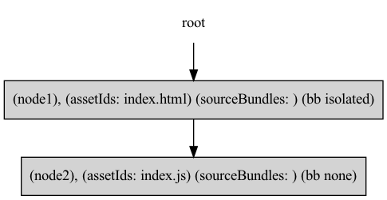
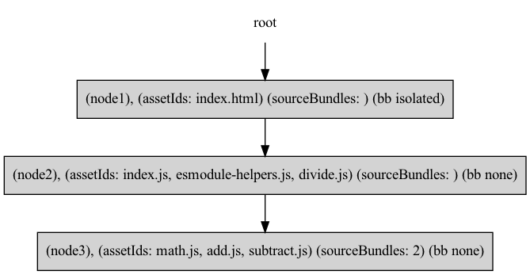

## Targets

To configure multiple targets, a user can specify them in their `package.json`

```json5
"targets": {
    "main1": {
      "distDir": "./dist/main1",
      "source": "./src/main1/index.html",
      "publicUrl": "./"
    },
    "main2": {
      "distDir": "./dist/main2",
      "source": "./src/main2/index.html",
      "publicUrl": "./"
    }
  },
```

This will then be interpreted from the `AssetGraph` into a map of targets, which contains the target as the key, and the value a map of entries to the dependencies with matching targets.

```
[Target Map] {
  '/dist/main1' => Map(1) {
    Asset(/main1/index.html) => Dependency(null -> src/main1/index.html)
  },
  'dist/main2' => Map(1) {
    Asset(/main2/index.html) => Dependency(null -> src/main2/index.html)
  }
```

`bundle()` is then called for **each** entry in the Map, creating two distinct `IdealGraphs`, and in this case, identical graphs. `createIdealGraph` skips any subtrees of another target.

```js
if (!entries.has(node.value)) {
  actions.skipChildren();
}
```

The sample file tree below represents the output created by the final `bundleGraph`

```
> dist
    > main1
        index.html
        index.a05w6.js
        shared.123.js
    > main2
        index.html
        index.b80d3.js
        shared.123.js
```

_The full test case can be found in the `supports multiple dist targets` case in `html.js` integration test file._

## Two CSS imports

Here we'll go through what occurs in an example where two entries to a project import different css files.

Consider an entry with imports to two css files, and an async file importing 1 of them

<table><tr>
<td>

```js
//entry.js

import './main.css';

import './Foo/foo.css';
import('./Foo');
```

</td><td>

```js
// Foo/foo.js

import './foo.css';

export default function () {
  return 'foo';
}
```

</td>
</tr></table>

Given one `js` entry, an async `js` import, and two `css` imports, we generate the following Assetgraph.


Below is the local bundleGraph generated after **Step Create Bundles**. **Node 1** is generated in the first step because it is specified as an entry to the project.


After **Step Create Bundles**, we have generated a bundle per entry, code-split points, and type-change bundles. We have four bundles, two of which are **bundleGroups**.

```
entry.js bundle -> BundleGroups [entry.js]
foo.js bundle -> BundleGroups [foo.js]
foo.css bundle -> BundleGroups [entry.js, index.js]
main.css bundle -> BundleGroups [entry.js]
```

In the state above, the `entry.js` bundle loads (or is connected to) two `.css` bundles, which is not correct. In order to maintain the constraint of one bundle of a different type per bundlegroup, we need to merge bundles together. However, merging `foo.css` and `main.css` will result in `index.js` over-fetching `main.css`

In order to maintain correctness, we may need to duplicate assets, and end up with the final `idealGraph` below.


_The full test case can be found in the `multi-css-multi-entry-bug/src/` integration test._

## Reused Bundle

Reused bundles are a special type of shared bundle. Consider the following code. (taken from the 'should reuse a bundle when its main asset (aka bundleroot) is imported synchronously'' test case in `javascript.js`)

<table><tr>
<td>

```js
//index.js

import('./foo');
import('./bar');
```

</td>
<td>

```js
//a.js

import foo from './foo';
```

</td>
<td>

```js
//bar.js
import foo from './a';
import bar from './b';
import styles from './styles.css';
import html from './local.html';
```

</td>
<td>

```js
// foo.js

import a from './a';
import b from './b';

export default a;
```

</td>
</tr></table>

We know we'll have bundles created for the entry, the two async imports, and the type change, which is reflected in the graph below. (A snapshot taken after **Step Create Bundles** )


But where do we place `a.js`, and `b.js` ? We will consult `reachableRoots`.

```
// ReachableRoots
foo => [a,b]
bar => [a, b, foo]
```

From the availability above, it should be clear that the best way to place `a` and `b` would be to place them into our existing `foo` bundle, and simply connect `bar` to it, since `bar` requires `foo` as well. That is exactly what we do.


### Reused Code Deep Dive

Here I will explain line by line how we actually place assets in the case of reused bundles.

During placement, we go through each asset, one by one, and determine the set of bundles it must be placed in.

```
for (let i = 0; i < assets.length; i++) { ... }
```

Then we handle placement for entries and manual shared assets, see [DefaultBundler.md](DefaultBundler.md) for a more detailed look at that section.

`ReachableNonEntries` is the set of bundleRoots needed by our asset, a, that are _not_ entries, isolated, etc.

We loop through them, searching for a `candidate`. Since we don't know which asset we will process first, we need to make sure we draw that connection between the bundles regardless of if we hit `a.js`, `b.js`, or `foo.js` first. There are two cases to consider.

1. Asset is a bundleRoot, in this case `foo.js`.
2. Asset is not a bundleRoot, in this case `a.js` or `b.js`

In the first case, we simply draw an edge and delete the `candidate` from this asset's reachable. We must delete it because this loop does not terminate asset placement, if reachable was still populated, we would go on to try to place our asset in the remaining reachable bundleroots.

```js
  let reuseableBundleId = bundles.get(asset.id);

  if (reuseableBundleId != null) { // asset is a bundleRoot
          reachable.delete(candidateId);
          bundleGraph.addEdge(candidateSourceBundleId, reuseableBundleId);

```

The second case is a bit more involved. Say we are trying to place `a.js`, we know `bar.js` and `foo.js` are both bundleRoots in our `reachable`, but we do not know which is a subtree of the other. i.e. which direction the edge should go. So we need to consult `reachableAssets`, which is an inverse mapping of `reachableRoots`. This exists because bitSets are not bidirectional.

So, we take the assets that are reachable from our candidate bundleRoot (in this case bar), and intersect it with our reachable.

```js
reachableIntersection.intersect(
  reachableAssets[
    nullthrows(assetToBundleRootNodeId.get(candidateSourceBundleRoot))
  ],
);
```

The above essentially translates to

```

reachable(a) ∩ reachable(candidateBundleRoot)

```

So when the `candidate = bar` and `asset` we are placing is `a`, we are able to intersect to get the actual reusable bundle, `foo.js`. Below is an example of the values we'd be intersecting in this particular test case, in the event that `a` is processed before `foo`.

```

reachableAssets
foo => {a,b}
bar => {foo,a,b}

reachableNonEntries of a
a => {bar, foo}
```

We draw an edge from our `reusableBundle` to our `otherCandidateId`

```js
bundleGraph.addEdge(
  nullthrows(bundles.get(candidateSourceBundleRoot.id)),
  reusableBundleId,
);
```

_The full test case can be found in the `shared-bundle-single-source/` case in `javascript.js` integration test file._

## Manual Bundles

Manual Bundles override Parcel's automatic code splitting. Consider the code below, with the following config in `package.json`.

```json
package.json:
    {
      "@parcel/bundler-default": {
        "manualSharedBundles": [{
          "name": "vendor",
          "root": "math/math.js",
          "assets": ["math/!(divide).js"]
        }]
      }
    }

```

From the above, the pertinent data structures will be populated as such:

```json
manualSharedObject =
  {
    "name": "vendor",
    "root": "math/math.js",
    "assets": ["math/!(divide).js"]
  }

parentsToConfig =
{
  "math/math.js": {
    "name": "vendor"
    "root": etc ...
  }
}

manualAssetToConfig = {
  "project/math/math.js": {
    {manualSharedObject}
  },
  "project/add.js": {
    {manualSharedObject}
  },
  "project/subtract.js": {
    {manualSharedObject}
  }
}
```

This allows us to look up any asset's `manualSharedObject`.

Below are the relevant files, our root, `math.js`, and `index.js`, which imports it. Please refer to the full test case in `bundler.js` for all source code.

<table><tr>
<td>
<td>

```js
//math:
math.js:
export * from './add';
export * from './subtract';
export * from './divide';
```

</td>
<td>

```js
index.js:
        import {add, subtract, divide} from './math/math';
        sideEffectNoop(divide(subtract(add(1, 2), 3), 4));

```

</td>
</tr></table>

After **Step Create Bundles**, we are left with two bundles, one bundle group. There are no manual bundles in the graph below because the config does not math any explicit code split point.



The remaining assets left to place during asset placement are, `math.js`, `add.js`, `subtract.js`, and `divide.js`. From `reachable` you can infer what Parcel would/should do. Simply place all remaining assets into `index.js`, right?

However, we've specified via config that we want `math` and its imports which match the glob `!(divide)` in one bundle with nothing else.

```
//reachable

math =>     [index.js]
add =>      [index.js]
subtract => [index.js]
divide =>   [index.js]
```

So that is exactly what happens. Looking up assets in the `manualAssetToConfig`, we place them into their own bundle, and connect it via edge and property `sourceBundles`. Source bundles property is equivalent to `reachable`.


_The full test case can be found in the `bundler.js` test suite._

## Debugging Notes

There are many more intricate and complex cases than what I've discussed above within Parcel's test suite. To understand the algorithm fully, debugging and visualizing the idealGraph structure is extremely beneficial. To do so, you may add the following in between steps within `DefaultBundler.js`,

```
dumpGraphToGraphViz(
    // $FlowFixMe
    bundleGraph,
    'IdealGraph-Step1',
  );
```

and run your example test case with the command below.

` PARCEL_DUMP_GRAPHVIZ=1yarn test test/<testsuite>`
